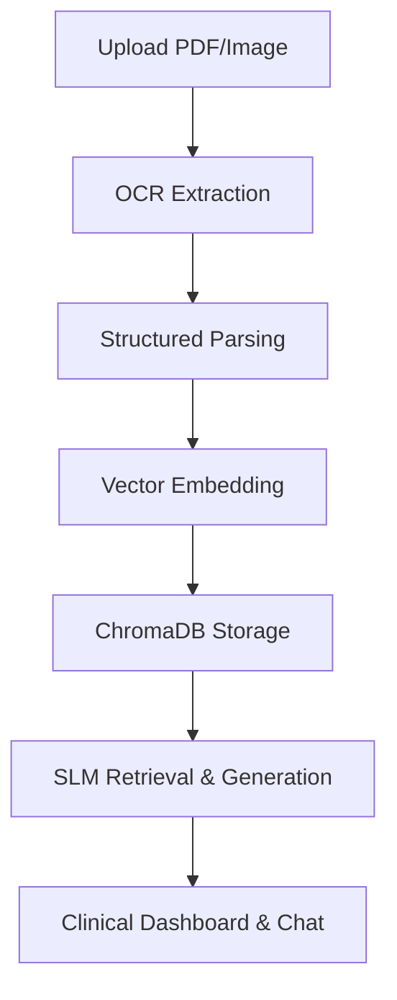

# MedRag Project Overview

## Tech Stack

**Backend:**
- Python (FastAPI)
- PaddleOCR, PyMuPDF, OpenCV
- LangChain (langchain-ollama, langchain-chroma)
- ChromaDB (Vector Database)
- MongoDB (Document Storage)

**Frontend:**
- React (TypeScript)
- Vite (Build Tool)
- ShadCN UI, Tailwind CSS v4
- Axios (API Client)
- Lucide-React (Icons)

---

## Why RAG (Retrieval-Augmented Generation)?

RAG combines document retrieval with generative AI. It allows the system to:
- Extract relevant information from medical reports (PDFs/images)
- Feed this evidence to a local Small Language Model (SLM) for context-aware answers
- Provide transparent, evidence-backed clinical guidance

This approach ensures:
- Privacy (local processing, no cloud LLMs)
- Explainability (source citations for every AI answer)
- Real-time, accurate medical analysis

---

## Project Structure & Flow

### Backend
- **ocr.py:** Converts PDFs/images to text using PaddleOCR + PyMuPDF
- **parse.py:** Parses raw OCR text into structured medical JSON
- **ingest.py:** Chunks and embeds documents, stores in ChromaDB
- **server.py:** FastAPI endpoints for upload, chat, evidence retrieval
- **utils_docs.py:** Normalizes and cleans medical data
- **mongo_helper.py:** Handles MongoDB persistence

### SLM Guidance
- **prompts.py:** Defines clinical persona, JSON schema, and guardrails for LLM
- **ollama_client.py:** Connects to Ollama for local SLM inference

### Frontend
- **App.tsx:** Main orchestration
- **services/api.ts:** Axios API calls to backend
- **components/dashboard:** Clinical dashboard, abnormal findings, insights
- **components/chat:** Chat interface for medical Q&A
- **components/layout:** Source evidence drawer

---

## Usage Flow
1. **Upload:** User uploads lab report (PDF/PNG)
2. **OCR:** Backend extracts text, parses into structured data
3. **Vector Ingestion:** Data is chunked, embedded, stored in ChromaDB
4. **Dashboard:** Frontend displays patient info, abnormal findings
5. **Chat:** User asks questions; SLM answers using retrieved evidence
6. **Evidence:** Clickable badges show exact text used for answers

---

## Details
- **Privacy:** All processing is local; no data leaves the machine
- **Explainability:** Every AI answer is backed by source text
- **Export:** Results can be exported to JSON/Excel
- **Disclaimer:** Not for medical diagnosis; always verify with professionals

---

## Example Technologies
- **Backend:** fastapi, paddleocr, pymupdf, langchain, chromadb, mongo
- **Frontend:** react, vite, tailwindcss, shadcn-ui, axios

---

## Why SLMs?
- SLMs (Small Language Models) are fast, lightweight, and privacy-friendly
- Used via Ollama for local inference
- Provide medical guidance without sending data to cloud

---

## RAG Pipeline Diagram

---

## Authors & License
- See README.md for contributors
- Proof-of-concept; not for clinical use
